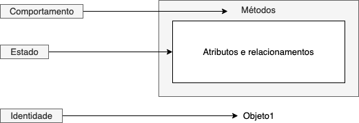

# Conceitos básicos de orientação a objetos

A essa altura do curso, você já deve estar familiarizado com orientação a objetos, já deve ter construído alguns projetos utilizando esse paradigma e deve se sentir confortável com alguns termos relacionados a classes, objetos, métodos e instância.

Aqui, iremos revisar de maneira breve os principais conceitos de orientação a objetos, que é tão importante para compreender os tópicos dessa disciplina.

### Por que orientação a objetos?

A Orientação a Objetos pode ser definida como um modelo de análise, projeto e programação de sistemas de software baseado na composição e interação entre unidades \(objetos\).

Usamos esse paradigma para, entre outras coisas, diminuir o que chamamos de [gap semântico](https://pt.qwe.wiki/wiki/Semantic_gap), isso é, a **diferença entre a maneira que descrevemos um problema no mundo real e a maneira como modelamos esse problema em linguagens de programação/representações formais**. Porém, não é correto pensar que a orientação a objetos modela o mundo real exatamente como ele é, pois isso pode trazer vários problemas de entendimento do domínio em contextos diferentes. Veremos alguns exemplos desse problema na disciplina.

O paradigma orientado a objeto não é o único que podemos utilizar, e algumas linguagens inclusive incorporam mais do que um paradigma em sua estrutura. Apesar de nos focarmos em orientação a objetos nessa disciplina, ao decorrer do curso, discussões sobre outros paradigmas também serão bem vindos.

### Objetos e classes

Um **objeto** pode ser definido como uma entidade de software com **identidade** e limites bem definidos que encapsula **estado** \(por meio de seus atributos e relacionamentos\) e **comportamento** \(por meio de seus métodos\).



O **estado** de um objeto é dado pelos seus **atributos e seus relacionamentos com outros objetos**. Cada vez que alteramos um atributo de um objeto por meio de um método `set`, por exemplo, estamos alterando seu estado. Por sua vez, o método `get` nos dá informações sobre o estado atual.

O **comportamento** de um objeto dita como essa entidade deve agir e reagir aos pedidos \(chamadas de métodos\) vindos de outros objetos. É o seu **conjunto de métodos** que diz o que o objeto é capaz de executar, ou seja, a interface de comunicação com outros objetos, onde o importante é que vejam o **que ele faz, e não como ele faz**. Iremos nos aprofundar nessa questão ao longo do curso.

Por fim, cada objeto tem sua própria **identidade**, mesmo que os estados e comportamentos de dois objetos sejam idênticos. No exemplo do código fonte abaixo, dois objetos são criados com o mesmo estado e tem identidades diferentes

```java
Pessoa p1 = new Pessoa("Fulano"); // Pessoa@74a14482
Pessoa p2 = new Pessoa("Fulano"); // Pessoa@1540e19d
```

Já a **classe** é apenas uma espécie de molde, uma “receita” que define para a linguagem o que um objeto criado a partir desse tipo deverá ter em termos de atributos e como ele deve se comportar, em termos de métodos.

**Classe** é um conceito utilizado em alguns linguagens e em outras não, como é o caso de JavaScript/ECMAScript. Classes em JavaScript, por exemplo, foram introduzidas apenas no ECMAScript 2015. Essas classes não oferecem, de fato, funcionalidades adicionais e são muitas vezes descritas como provedoras do que chamamos de "[açúcar sintático](https://www.digitalocean.com/community/tutorials/understanding-classes-in-javascript-pt)" em relação a protótipos e herança, sendo que estes oferecem uma sintaxe mais limpa e mais elegante. Uma vez que outras linguagens de programação usam o conceito de classes, a sintaxe de classe no JavaScript vem para tornar as coisas mais simples e para que desenvolvedores consigam **transitar entre linguagens**.

### Encapsulamento

Encapsulamento vem de encapsular, que em programação orientada a objetos significa separar o programa em partes, o mais isoladas possível. A ideia é tornar o software mais flexível, fácil de modificar e de criar novas implementações.

O encapsulamento protege o acesso direto aos atributos de uma instância vindo de fora da classe onde estes foram declarados. Esta proteção consiste em se usar modificadores de acesso mais restritivos \(como `private`\) sobre os atributos definidos na classe. Depois devem ser criados métodos para manipular de forma indireta os atributos da classe. É por isso que fazemos `get` e `set`.

Encapsular atributos também auxilia a **garantir que o estado e o comportamento de um objeto se mantenha coeso**. Imagine a situação onde você tem a seguinte classe.

```java
public class Pessoa {

    private List<String> numerosContato;
    
    public List<String> getNumerosContato() {
        return this.numerosContato;
    }
    public void setNumerosContato(List<String> numerosContato) {
        this.numerosContato = numerosContato;
    }
}
```

Esse código demonstra como o encapsulamento é importante. Ao gerarmos um `get` e um `set` \(comuns, como geralmente as IDEs sugerem\) para uma coleção estamos **quebrando a proteção contra acesso direto aos atributos**, ou seja, quebramos o encapsulamento.


**Problemas ao quebrar o encapsulamento**

Imagine que um componente do sistema realizou uma chamada da seguinte maneira: `getNumerosContato().add("1729817982")`. Estamos **mudando o estado do objeto `Pessoa`** sem que ele tenha **conhecimento** disso, uma vez que a adição não passou por um método do mesmo. 

Indo além, podemos imaginar um cenário onde dois componentes \(`X` e `Y`\) usam o mesmo objeto `Pessoa` e em um **primeiro** momento, `X` solicita `getNumerosContato()` para executar alguma lógica de negócios. Se `Y` realiza uma chamada `setNumerosContato(...)` em um **segundo momento**, alterando completamente a colegação, significa dizer que a **lógica executada por `X` passa a ser inconsistente**.

Vários cenários podem ser explorados quando falamos de quebra de encapsulamento, principalmente quando falamos de [programação concorrente](https://pt.wikipedia.org/wiki/Programa%C3%A7%C3%A3o_concorrente).


### Relacionamentos

#### Associação

É o tipo de relacionamento mais comum e mais importante em um sistema orientado a objetos. É um relacionamento ou ligação entre duas classes permitindo que objetos criados a partir destas possam se comunicar, podendo essa comunicação ser uni ou bidirecional.

As associações podem ser de dois tipos: **Agregação** ou **Composição**.

#### Agregação

É um tipo de associação onde tenta-se demonstrar que as informações de um objeto \(chamado objeto-todo\) precisam ser complementados pelas informações contidas em um ou mais objetos de outra classe \(chamados objetos-parte\).

Os objetos-parte nesse tipo de associação tem fraca dependência para o objeto-todo e **podem existir separadamente**.

#### Composição

Pode-se dizer que composição é uma variação da agregação. Uma composição tenta representar também uma relação todo - parte. No entanto, na composição o objeto-todo é responsável por criar e destruir suas partes. Em uma composição um mesmo objeto-parte não pode se associar a mais de um objeto-todo.

Se o objeto-todo for destruído, as classes da agregação de composição serão destruídas juntamente, já que as mesmas fazem parte da outra.

### Herança

**Herança** é um dos pontos chave de programação orientada a objetos. A ideia de herança é facilitar a programação e principalmente reutilizar código. Deitel, em "[Java: Como Programar](https://books.google.com.br/books/about/Java.html?id=2gNRswEACAAJ&source=kp_book_description&redir_esc=y)", diz que "quando utilizamos herança para criar uma classe a partir da classe existente, a nova classe herda os atributos e comportamentos dessa classe existente, podendo adicionar atributos e comportamentos para solucionar nossas necessidades". Quando uma classe herda de outra, dizemos que ela **especializa** comportamento, enquanto a classe base **generaliza** comportamento.

Deve acontecer quando duas classes tem **semânticas próximas**, têm **características mútuas** mas não são iguais. Portanto, em vez de escrever todo o código novamente é possível ganhar tempo e dizer que uma classe herda da outra e depois basta escrever o código para a especificação dos pontos necessários da classe derivada \(classe que herdou\).

Entre os problemas que trazemos ao utilizar Herança está o **fraco encapsulamento** e o **forte acoplamento** entre as classes base e derivadas, onde ao mudar a classe base, as subclasses também serão afetadas. Além disso, em certas ocasiões um objeto precisa ser de uma classe diferente em momentos diferentes, o que não é possível com a herança, pois o código não pode sofrer alterações facilmente em tempo de execução, tornando a herança um relacionamento estático.

#### Herança ou composição?

A herança e a composição são recursos destinados para **reutilização de funcionalidades**, mas **quando usar um ou outro**? Enquanto a herança cria um reuso de código estático, a composição faz isso em tempo de compilação, provendo mais flexibilidade pro código, diminuindo acoplamento e, de quebra, deixando espaço para que a herança seja usada no futuro caso seja **realmente** necessário. Sendo assim, a herança deve ser utilizada em alguns relativamente poucos contextos.

No exemplo da Figura abaixo, a classe base `Pessoa` tem duas classes derivadas, `Passageiro` e `Agente`, o que faz sentido uma vez que exista uma entidade `Pessoa` que **é** apenas `Passageiro` **ou** `Agente` no contexto do sistema.


Porém, suponha que uma `Pessoa` pode mudar de papel ou assumir combinações de papeis durante a execução do sistema. A herança já não daria suporte a essa flexibilidade. Usar composição nesse caso pode nos dar a oportunidade de estender a funcionalidade de `Pessoa` de várias formas, mas sem usar herança. A Figura abaixo mostra uma mudança do exemplo anterior, dessa vez usando composição.


Aqui, estamos usando de **delegação**: dois objetos estão envolvidos em atender um pedido/responsabilidade \(digamos `setNome`\)

O objeto `Agente`, por exemplo, delega `setNome` para o objeto pessoa que ele tem por composição. É semelhante a uma subclasse delegar uma de suas operações para a classe base \(herdando a operação\). Delegação **sempre pode ser usada para substituir a herança**. Em vez de `Agente` **ser** uma pessoa, ele **tem** um objeto desse tipo.

A grande vantagem em usar composição nesses casos é que o comportamento pode ser escolhido em tempo de execução, ao invés de estar amarrado em tempo de compilação. A grande desvantagem é que um software muito dinâmico e parametrizado é mais difícil de entender do que software mais estático. Mais detalhes sobre essa discussão podem ser encontrados [aqui](http://www.dsc.ufcg.edu.br/~jacques/cursos/map/html/pat/herancavscomposicao.htm).

### Realização

A Realização ocorre quando existe um relacionamento entre uma `Interface` \(como conhecemos em Java\) e a classe que implementa seus métodos. Na prática, a palavra-chave `implements` caracteriza uma realização.

Quando uma classe "**realiza**" ou "**implementa**'' uma interface, ela concorda em prover detalhes sobre **como** aquele método deve ser executado, enquanto a interface diz apenas **o que** deve ser feito.

### Polimorfismo

**Polimorfismo**, no sentido da palavra, é "_qualidade ou estado de ser capaz de assumir diferentes formas_". Na orientação a objetos, o polimorfismo denota uma situação na qual um objeto pode se comportar de maneiras diferentes ao receber uma mensagem \(chamada de método\). Podem ser de dois tipos: **estático ou dinâmico**.

#### Polimorfismo Estático ou Sobrecarga

Ocorre onde o mesmo método é implementado várias vezes na mesma classe. Métodos sobrecarregados são escritos com o mesmo nome, mas com uma lista de **argumentos diferentes**. São geralmente usados dentro de uma mesma classe.

É importante notar que existem algumas regras para a sobrecarga acontecer. O Código Fonte abaixo mostra dois métodos definidos em uma mesma classe/interface. Esse exemplo compila e funciona normalmente pois temos **números de parâmetros diferentes**.

```java
public void operacao(String s) { ... }
public void operacao(String s, Integer i) { ... }
```

Podemos também ter o mesmo número de parâmetros, porém com **tipos diferentes**.

```java
public void operacao(String s) { ... }
public void operacao(Integer i) { ... }
```

E também o mesmo número de parâmetros com os mesmos tipos, porém em **posições diferentes**.

```java
public void operacao(Integer i, String s) { ... }
public void operacao(String s, Integer i) { ... }
```

É importante observar que **apenas a posição do tipo importa**. Trocar apenas os nomes dos parâmetros não faz com que a sobrecarga ocorra. O código abaixo, por exemplo, não compila:

```java
public void operacao(Integer i, String s) { ... }
public void operacao(Integer i2, String s2) { ... }
```

#### Polimorfismo Dinâmico ou Sobrescrita

Acontece ao utilizarmos herança ou realizar uma interface, quando a subclasse sobrepõe ou implementa o método original. O método escolhido se dará em tempo de execução e não mais em tempo de compilação. Os métodos são implementados/modificados nas subclasses, ganhando corpo de acordo com as necessidades específicas de cada uma. A sobrescrita de métodos consiste basicamente em criar um novo método na classe filha contendo a mesma assinatura e mesmo tipo de retorno do método sobrescrito.

Na Figura abaixo, a classe base `DAO` \(que poderia ser uma classe abstrata ou mesmo uma inteface\) define um método `salvar` que será sobrescrito nas classes `DAOMySQL` e `DAOMongo`.


Considere o código abaixo onde criamos dois objetos usando a mesma abstração `DAO`. O método que estamos invocando é o mesmo \(`salvar`\), porém, a implementação que será executada depende da instância do objeto, o que caracteriza o polimorfismo. Na Linha 2, o método invocado na prática é o implementado em `DAOMySQL`, já na Linha 4, o que foi implementado em `DAOMongo`.

```java
DAO dao = new DAOMySQL();
dao.salvar(objeto);
dao = new DAOMongo();
dao.salvar(objeto);
```

