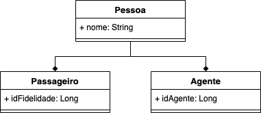

# Herança

**Herança** é um dos pontos chave de programação orientada a objetos. A ideia de herança é facilitar a programação e principalmente reutilizar código. Deitel, em "[Java: Como Programar](https://books.google.com.br/books/about/Java.html?id=2gNRswEACAAJ&source=kp_book_description&redir_esc=y)", diz que "quando utilizamos herança para criar uma classe a partir da classe existente, a nova classe herda os atributos e comportamentos dessa classe existente, podendo adicionar atributos e comportamentos para solucionar nossas necessidades". Quando uma classe herda de outra, dizemos que ela **especializa** comportamento, enquanto a classe base **generaliza** comportamento.

Deve acontecer quando duas classes tem **semânticas próximas**, têm **características mútuas** mas não são iguais. Portanto, em vez de escrever todo o código novamente é possível ganhar tempo e dizer que uma classe herda da outra e depois basta escrever o código para a especificação dos pontos necessários da classe derivada \(classe que herdou\).

Entre os problemas que trazemos ao utilizar Herança está o **fraco encapsulamento** e o **forte acoplamento** entre as classes base e derivadas, onde ao mudar a classe base, as subclasses também serão afetadas. Além disso, em certas ocasiões um objeto precisa ser de uma classe diferente em momentos diferentes, o que não é possível com a herança, pois o código não pode sofrer alterações facilmente em tempo de execução, tornando a herança um relacionamento estático.

## Herança ou composição?

A herança e a composição são recursos destinados para **reutilização de funcionalidades**, mas **quando usar um ou outro**? Enquanto a herança cria um reuso de código estático, a composição faz isso em tempo de compilação, provendo mais flexibilidade pro código, diminuindo acoplamento e, de quebra, deixando espaço para que a herança seja usada no futuro caso seja **realmente** necessário. Sendo assim, a herança deve ser utilizada em alguns relativamente poucos contextos.

No exemplo da Figura abaixo, a classe base `Pessoa` tem duas classes derivadas, `Passageiro` e `Agente`, o que faz sentido uma vez que exista uma entidade `Pessoa` que **é** apenas `Passageiro` **ou** `Agente` no contexto do sistema.

Porém, suponha que uma `Pessoa` pode mudar de papel ou assumir combinações de papeis durante a execução do sistema. A herança já não daria suporte a essa flexibilidade. Usar composição nesse caso pode nos dar a oportunidade de estender a funcionalidade de `Pessoa` de várias formas, mas sem usar herança. A Figura abaixo mostra uma mudança do exemplo anterior, dessa vez usando composição.

Aqui, estamos usando de **delegação**: dois objetos estão envolvidos em atender um pedido/responsabilidade \(digamos `setNome`\)

O objeto `Agente`, por exemplo, delega `setNome` para o objeto pessoa que ele tem por composição. É semelhante a uma subclasse delegar uma de suas operações para a classe base \(herdando a operação\). Delegação **sempre pode ser usada para substituir a herança**. Em vez de `Agente` **ser** uma pessoa, ele **tem** um objeto desse tipo.

A grande vantagem em usar composição nesses casos é que o comportamento pode ser escolhido em tempo de execução, ao invés de estar amarrado em tempo de compilação. A grande desvantagem é que um software muito dinâmico e parametrizado é mais difícil de entender do que software mais estático. Mais detalhes sobre essa discussão podem ser encontrados [aqui](http://www.dsc.ufcg.edu.br/~jacques/cursos/map/html/pat/herancavscomposicao.htm).

