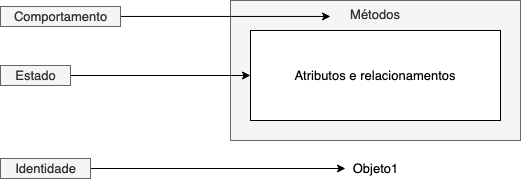

# Objetos e classes

Um **objeto** pode ser definido como uma entidade de software com **identidade** e limites bem definidos que encapsula **estado** \(por meio de seus atributos e relacionamentos\) e **comportamento** \(por meio de seus métodos\).



O **estado** de um objeto é dado pelos seus **atributos e seus relacionamentos com outros objetos**. Cada vez que alteramos um atributo de um objeto por meio de um método `set`, por exemplo, estamos alterando seu estado. Por sua vez, o método `get` nos dá informações sobre o estado atual.

O **comportamento** de um objeto dita como essa entidade deve agir e reagir aos pedidos \(chamadas de métodos\) vindos de outros objetos. É o seu **conjunto de métodos** que diz o que o objeto é capaz de executar, ou seja, a interface de comunicação com outros objetos, onde o importante é que vejam o **que ele faz, e não como ele faz**. Iremos nos aprofundar nessa questão ao longo do curso.

Por fim, cada objeto tem sua própria **identidade**, mesmo que os estados e comportamentos de dois objetos sejam idênticos. No exemplo do código fonte abaixo, dois objetos são criados com o mesmo estado e tem identidades diferentes

```java
Pessoa p1 = new Pessoa("Fulano"); // Pessoa@74a14482
Pessoa p2 = new Pessoa("Fulano"); // Pessoa@1540e19d
```

Já a **classe** é apenas uma espécie de molde, uma “receita” que define para a linguagem o que um objeto criado a partir desse tipo deverá ter em termos de atributos e como ele deve se comportar, em termos de métodos.

**Classe** é um conceito utilizado em alguns linguagens e em outras não, como é o caso de JavaScript/ECMAScript. Classes em JavaScript, por exemplo, foram introduzidas apenas no ECMAScript 2015. Essas classes não oferecem, de fato, funcionalidades adicionais e são muitas vezes descritas como provedoras do que chamamos de "[açúcar sintático](https://www.digitalocean.com/community/tutorials/understanding-classes-in-javascript-pt)" em relação a protótipos e herança, sendo que estes oferecem uma sintaxe mais limpa e mais elegante. Uma vez que outras linguagens de programação usam o conceito de classes, a sintaxe de classe no JavaScript vem para tornar as coisas mais simples e para que desenvolvedores consigam **transitar entre linguagens**.

