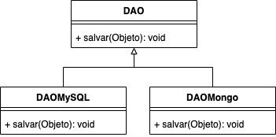

# Polimorfismo

**Polimorfismo**, no sentido da palavra, é "_qualidade ou estado de ser capaz de assumir diferentes formas_". Na orientação a objetos, o polimorfismo denota uma situação na qual um objeto pode se comportar de maneiras diferentes ao receber uma mensagem \(chamada de método\). Podem ser de dois tipos: **estático ou dinâmico**.

#### Polimorfismo Estático ou Sobrecarga

Ocorre onde o mesmo método é implementado várias vezes na mesma classe. Métodos sobrecarregados são escritos com o mesmo nome, mas com uma lista de **argumentos diferentes**. São geralmente usados dentro de uma mesma classe.

É importante notar que existem algumas regras para a sobrecarga acontecer. O Código Fonte abaixo mostra dois métodos definidos em uma mesma classe/interface. Esse exemplo compila e funciona normalmente pois temos **números de parâmetros diferentes**.

```java
public void operacao(String s) { ... }
public void operacao(String s, Integer i) { ... }
```

Podemos também ter o mesmo número de parâmetros, porém com **tipos diferentes**.

```java
public void operacao(String s) { ... }
public void operacao(Integer i) { ... }
```

E também o mesmo número de parâmetros com os mesmos tipos, porém em **posições diferentes**.

```java
public void operacao(Integer i, String s) { ... }
public void operacao(String s, Integer i) { ... }
```

É importante observar que **apenas a posição do tipo importa**. Trocar apenas os nomes dos parâmetros não faz com que a sobrecarga ocorra. O código abaixo, por exemplo, não compila:

```java
public void operacao(Integer i, String s) { ... }
public void operacao(Integer i2, String s2) { ... }
```

#### Polimorfismo Dinâmico ou Sobrescrita

Acontece ao utilizarmos herança ou realizar uma interface, quando a subclasse sobrepõe ou implementa o método original. O método escolhido se dará em tempo de execução e não mais em tempo de compilação. Os métodos são implementados/modificados nas subclasses, ganhando corpo de acordo com as necessidades específicas de cada uma. A sobrescrita de métodos consiste basicamente em criar um novo método na classe filha contendo a mesma assinatura e mesmo tipo de retorno do método sobrescrito.

Na Figura abaixo, a classe base `DAO` \(que poderia ser uma classe abstrata ou mesmo uma inteface\) define um método `salvar` que será sobrescrito nas classes `DAOMySQL` e `DAOMongo`.



Considere o código abaixo onde criamos dois objetos usando a mesma abstração `DAO`. O método que estamos invocando é o mesmo \(`salvar`\), porém, a implementação que será executada depende da instância do objeto, o que caracteriza o polimorfismo. Na Linha 2, o método invocado na prática é o implementado em `DAOMySQL`, já na Linha 4, o que foi implementado em `DAOMongo`.

```java
DAO dao = new DAOMySQL();
dao.salvar(objeto);
dao = new DAOMongo();
dao.salvar(objeto);
```

