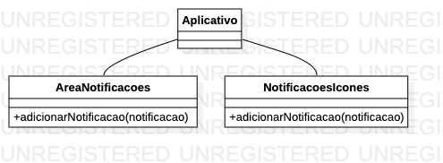
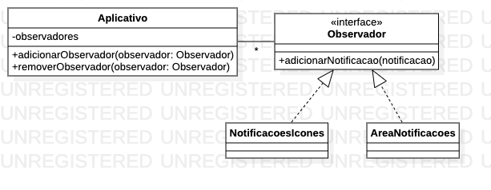

# Padrão Observer

O Padrão **Observer** é um padrão de projeto de software que define uma **dependência um-para-muitos** entre objetos de modo que quando um **objeto interessante** muda o estado, todos seus dependentes \(**objetos interessados**\) são notificados e atualizados automaticamente.

### **Problema**

Imagine um sistema operacional para smartphones, como o Android ou iOS, onde cada “**novidade**” dos aplicativos é notificada para áreas especificas da interface com o usuário, como na imagem abaixo.


Já parou pra pensar como seria se não tivessemos as notificações dos aplicativos? 

Nesse cenário imaginário, como faríamos para ter conhecimento das informações dos aplicativos se os mesmos não nos notificam do que está acontecendo? Teriamos que consultar todos os aplicativos de redes sociais, por exemplo, para verificar se existem **novidades** que precisam da nossa atenção. Sendo assim, teriamos:

* Maior gasto de tempo para verificar todos os aplicativos
* Alto custo de processamento
* Grande consumo de bateria

Se já gastamos muito tempo olhando o celular mesmo tendo as notificações para nos avisar de **quando** olhar, imagina se não tivessemos.

O padrão observer parte de um problema semelhante ao que discutimos aqui, como podemos **notificar** **outros objetos** quando o estado ou um evento interessante acontecerem em um objeto específico?

Se pensarmos em ter uma referência circular, ou seja, dois objetos que apontam um para o outro, teremos os seguintes problemas:

* Os objetos **vão se conhecer em tempo de compilação**
* Adição de **novos objetos interessados vai ser custosa**

Sendo assim, como podemos acoplar esses objetos

* De modo que **não se conheçam em tempo de compilação**?
* De forma a **criar o acoplamento e desfazê-lo a qualquer momento em tempo de execução**?

### Solução

O Padrão Observer descreve como estabelecer esse relacionamento entre **observado** \(objeto interessante\) e **observador** \(cliente\). Observadores são avisados da mudança de estado ou outros eventos ocorrendo num “objeto interessante”. Pensando ainda no exemplo do smartphone, podemos imaginar as seguintes classes, apenas para fins didáticos



`Aplicativo` é o objeto a ser observado e, para notificar os objetos observadores `AreaNotificacoes` e `NotificacoesIcones` ele cria uma dependência, **conhecendo os itens em tempo de compilação** e tendo problemas para adicionar novos objetos interessados quando isso for necessário.

Vamos refatorar esse exemplo para usar uma interface, pensando no mesmo exemplo do [DIP - Princípio de Inversão de Dependência](../principios-solid/dip-principio-de-inversao-de-dependencia.md), aplicado a esse contexto.

O padrão Observer sugere que você **adicione um mecanismo de assinatura** para a classe observada para que objetos observadores possam "assinar" ou "desassinar" uma corrente de eventos vindo daquela fonte. Esse mecanismo consiste em 1\) um **vetor/coleção** para armazenar uma lista de referências aos objetos interessados e 2\) alguns **métodos públicos** que permitem adicionar assinantes e removê-los da lista.



Agora, **sempre que um evento importante acontece** com o objeto observado, ele **invoca o método** `adicionarNotificacao` de todos os seus `observadores`. 

Aplicações reais podem ter dúzias de diferentes classes observadores que estão interessadas em acompanhar eventos da mesma classe observada, criar um acoplamento entre todas elas é inviável. Além disso, você **pode nem estar ciente de algumas delas** em tempos de compilação, realizando o acoplamento em tempo de execução.

É por isso que é crucial que todos os assinantes implementem a mesma interface e que a **classe observada** comunique-se com eles **apenas através daquela interface**. Essa interface deve declarar o método de notificação junto com um conjunto de parâmetros que a publicadora pode usar para passar alguns dados contextuais junto com a notificação.

### Exemplo de Observer nas APIs nativas do Java

Um dos exemplos mais claros de aplicação do padrão **Observer** na API nativa do Java é o framework **Swing**, para desenvolvimento de aplicações desktop. Embora seja pouco usada atualmente, toda ela é baseada no conceito de eventos, que podemos entender como os eventos interessantes, dos quais falamos anteriormente.

Quando adicionamos um `ActionListener` a um botão, para que ele executa algo ao ser clicado, estamos adicionando um "**observador**". No exemplo abaixo, o objeto que vai ser esse observador está sendo criado por meio de uma [classe anônima](https://www.codeflow.site/pt/article/java-anonymous-classes).

```java
botao.addActionListener(new ActionListener() { //Classe Anônima
    @Override
    public void actionPerformed(ActionEvent e) {
        System.out.println("Clicado!");
    }
});
```

### Referências

* [Refactoring.guru](https://refactoring.guru/pt-br/design-patterns/observer)
* “**Design Patterns: Elements of Reusable Object-Oriented Software**”

