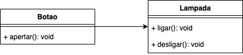
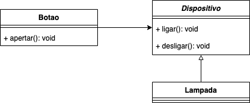

# DIP - Princípio de Inversão de Dependência

O **Princípio de inversão de dependência** é comumente separado em dois conceitos principais que o definem.

* **Módulos de alto nível não devem depender dos módulos de baixo nível**. Os dois devem ser baseados em abstrações.
* **Abstrações não devem ser baseadas em detalhes**. Detalhes devem ser baseados em abstrações.

Para entender a idéia de módulos de alto e baixo nível, vamos trabalhar com um exemplo didático simples de aplicação desse conceito: imagine uma classe `Botao` e uma classe `Lampada`. Utilizando um diagrama para ilustrar como um modelo seria implementado **sem o principio de inversão de dependência**, o modelo ficaria assim



Em que o botão ligaria a lâmpada, caso ela esteja desligada, e desligaria a lâmpada, caso ela esteja ligada. Sua implementação seria algo assim:

```java
public class Botao {

    private Lampada lampada;
    
    public void apertar() {
        if (lampada.estaLigada())
            lampada.desligar();
        else
            lampada.ligar();
    }
}
```

E por que esse programa **não seria adequado**? Porque `Botao` somente seria adequado para **ligar ou desligar uma** `Lampada`. Caso os desenvolvedores do sistema desejem que esse botão seja utilizado para desligar um portão eletrônico, por exemplo, deve ser feitas grandes mudanças no método de `apertar()` do `Botao` para que ele passe a funcionar onde ele é necessário. Ou seja, um módulo de alto nível \(`Botao`\) está dependendo de um módulo de baixo nível \(`Lampada`\).

Podemos resolver essa quebra do **Princípio de Inversão de Dependência** usando uma interface, para que nosso módulo de alto nível passe a ser baseado em abstrações.



Usar uma **classe abstrata** como **`Dispositivo`** faz com que `Botao` funcione com qualquer uma das classes que implementarem seus métodos via herança. Sendo assim, `Botao` não precisa entender os detalhes de `Lampada` ou qualquer outra classe que venha a ser um `Dispositivo` no futuro.

