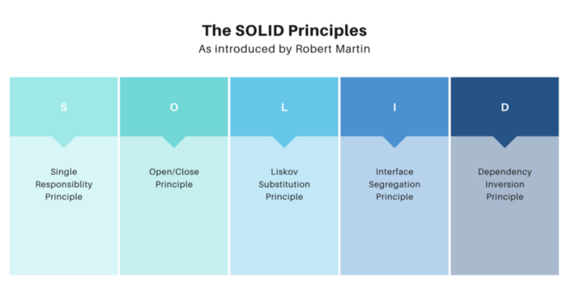

# Introdução

Aprender orientação a objetos não nos previne de escrever um **código confuso** ou, pior ainda, um software com baixa manutenibilidade. Escrever um bom código, usando de maneira correta os conceitos desse paradigma requer muita prática e experiência. Felizmente, muitos projetistas de software documentam o que chamamos de padrões de projeto, que nada mais são do que "boas práticas" de orientação a objetos para determinados problemas.

Além dos padrões de projeto, que veremos ao longo da disciplina, existem princípios que guiam o bom desenvolvimento de software orientado a objetos e que podem ser vistos em prática na aplicação dos padrões.

Um grupo de princípios de desenvolvimento de software foi agrupada por [Robert Cecil Martin](https://pt.wikipedia.org/wiki/Robert_Cecil_Martin). Esses **cinco princípios** nos guia de como podemos criar softwares legíveis e sustentáveis. Eles serão apresentados nesse módulo como **SOLID**, uma referência a inicial de um dos princípios. Não existe uma ordem para entendê-los, muito menos para aplicá-los, então fique a vontade para estudar na sua ordem.

